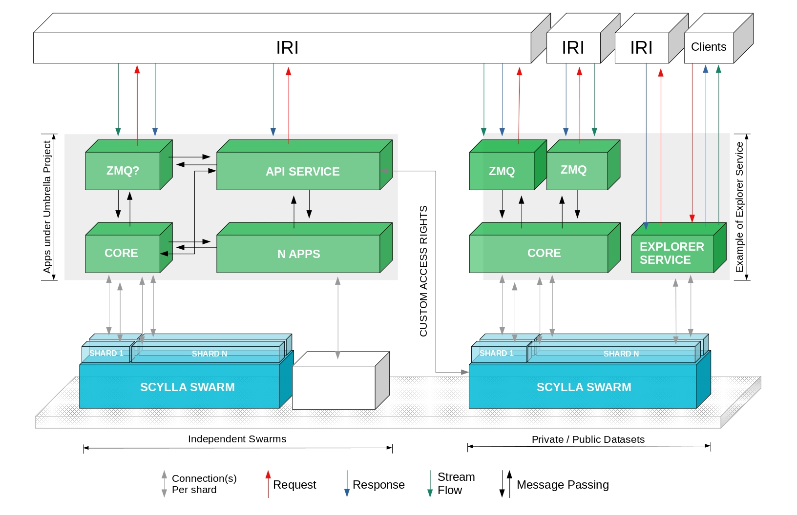
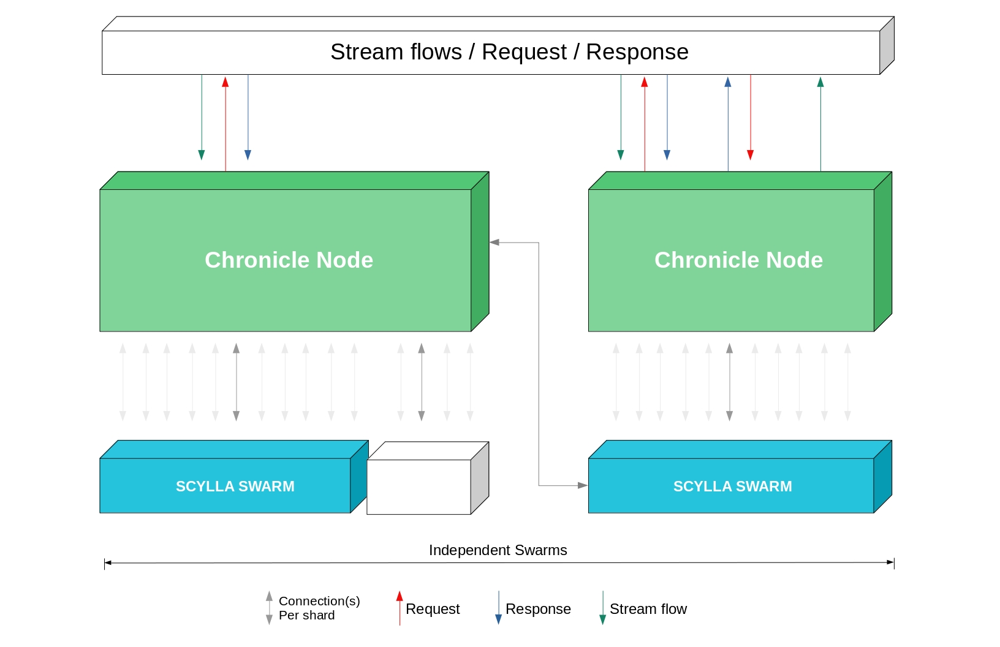
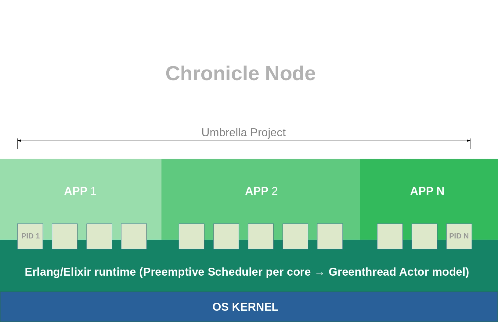
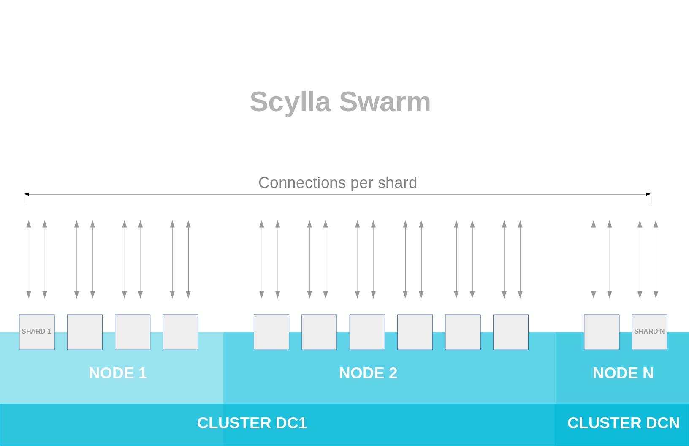
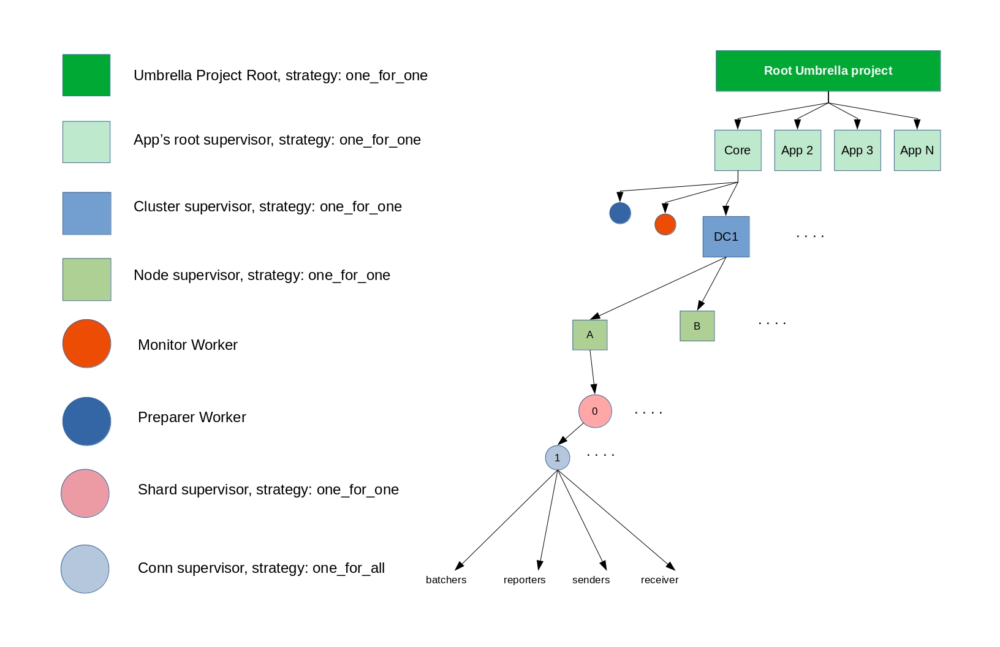
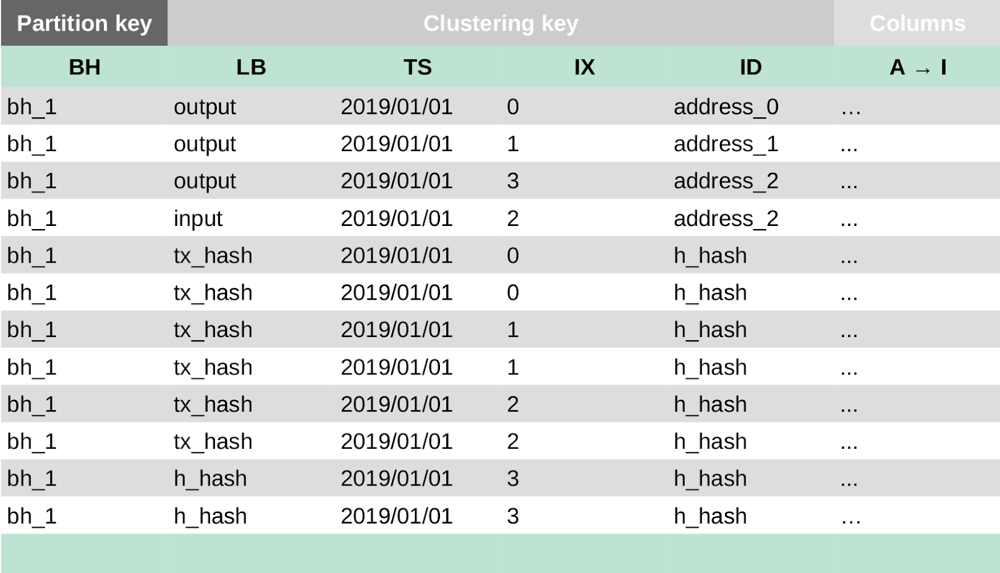
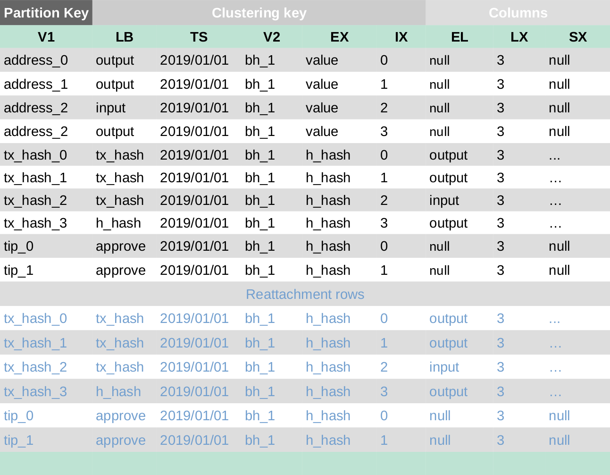
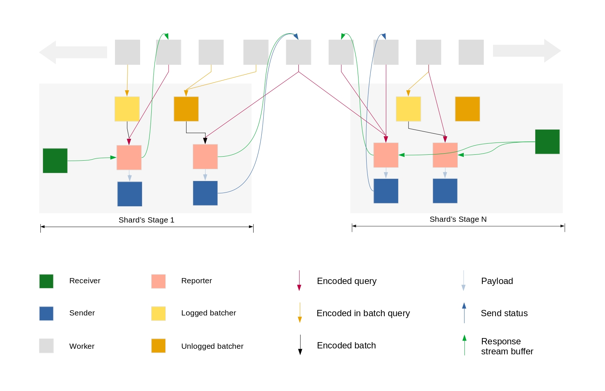

# 
 Chronicle System Architecture 

Version <01>-<draft>

May 07, 2019

##  1. OVERVIEW 

### 1.1 PURPOSE
---

This document provides a high-level description of the technical solution for the *Chronicle* project. This solution was conceived with the goal of addressing all requirements described in the *Permanode* Business Requirements Document. This document describes the major components that will make up the solution, the dependencies between them, and how they will work together.
This document is intended to

-   Capture all design considerations.

-   Capture architecture level technical design decisions.

-   Enable a smooth transition into operations.

-   Support the onboarding of new developers into the project more efficiently and effectively.

This is a living document. It is expected that the technical architects will update this document as the project progresses until the project is complete and the system is promoted into production.

### 1.2 ABOUT
----

Chronicle is a distributed fault tolerance permanode that scales out and up, designed and developed in a battle tested Elixir/Erlang ecosystem. It provides a complex network infrastructure which can be extended with various functionality through Multiplex networks, by building microservices for each layer, that can communicate with public and private dataset(s) under different policies.

In the era of big data, a single node cannot hold an unbounded dataset. Even if it could, the I/O of a single node would be a bottleneck. Thus a distributed or clustered approach is required, for storing/archiving data with no single point of failure and also making it useful for future queries. Chronicle leverages ScyllaDB as back-end storage, to fulfill the requirements of the big data era: partitioning, replication, in-memory processing, consistency, transaction and user concepts.

### 1.3 IN SCOPE
---
-   Chronicle system architecture

-   Data model

-   Query Engine

-   Data Flow

### 1.4 OUT OF SCOPE
---
-   Deployment infrastructure

##  2. ABBREVIATION LIST 

| Abbreviation | Description                                   |
|--------------|-----------------------------------------------|
| Chronicle    | Flexible Permanode architecture               |
| Scylla swarm | Fully Independent Scylla network              |
| Scylla shard | Thread which own specific tokens (partitions) |
| BH           | Bundle Hash                                   |
| LB           | Label                                         |
| TS           | Timestamp                                     |
| LX           | Last Index                                    |
| SX           | Snapshot Index                                |
| EL           | Extra Label                                   |
| EX           | Extra Vertex                                  |
| V1           | Vertex One                                    |
| V2           | Vertex Two                                    |
| TX_HASH      | Transaction Hash                              |
| H_hash       | Head Hash (IX == LX)                          |
| TTL          | Time To Live                                  |
| RF           | Replication Factor                            |

##  3. ROLES AND RESPONSIBILITIES 

-   System Development life cycle

    -   Chronicle's team

    -   Open source community

-   Third-party software component

    -   Client's team

-   Verifiable process for transitioning previous database data
    structures to the new chronicle structure

    -   Chronicle's team

    -   IRI's team

##  4. PROJECT REFERENCES 

-   Elixir Language: [https://elixir-lang.org](https://elixir-lang.org)

-   Adopting Elixir From Concept to Production, [http://shop.oreilly.com/product/9781680502527.do](http://shop.oreilly.com/product/9781680502527.do)

-   ScyllaDB documents: [https://docs.scylladb.com/](https://docs.scylladb.com/)

-   Nodetool utility [https://docs.scylladb.com/operating-scylla/nodetool/](https://docs.scylladb.com/operating-scylla/nodetool/)

-   ScyllaDB benchmark/cost [https://www.scylladb.com/2018/07/06/scylla-vs-cassandra-ec2/](https://www.scylladb.com/2018/07/06/scylla-vs-cassandra-ec2/)

##  5. DESIGN CONSIDERATIONS 

### 5.1 ASSUMPTIONS
---

-   Load balanced cluster (adding more nodes as the datasets grow.)

-   Co-location with redundant power and internet

-   Do not share the same node for Chronicle and Scylla, and if you must for small workloads then make sure to statically partition resources (taskset, memory reserves, cpuset, etc)

-   Jumbo MTU(9000 bytes) between Scylla and Chronicle (recommended).

### 5.2 CONSTRAINTS
---

-   Follow ScyllaDB requirements (XFS filesystem, bare-metal setup, etc).

-   Chronicle runtime requires enough memory to handle sufficient connections and API calls for the tasks it will undertake.

-   IP transit limitation, therefore both the ScyllaDB cluster and the corresponding chronicle node(s) should coexist/colocate in the same datacenter.

### 5.3 CONTINGENCY
---

#### 5.3.1 ScyllaDB

-   Single Data center,[SimpleStrategy](https://docs.datastax.com/en/cassandra/3.0/cassandra/architecture/archDataDistributeReplication.html) Topology (currently supported by chronicle)

	-   Failure with full power outage.

	-   Safe in case of extended downtime (check hinted handoff) for N nodes and a keyspace with reasonable replication factor, e.g.single node failure allowable when RF=3.

-   Multiple Data Centers,[NetworkTopologyStrategy](https://www.google.com/url?q=https://docs.datastax.com/en/cassandra/3.0/cassandra/architecture/archDataDistributeReplication.html&sa=D&ust=1557585961092000&usg=AFQjCNGpXefHciSMXIhJxzlFAa0ORwrp2g) (currently not supported by chronicle)

	-   Full power outage for a single rack or datacenter will not affect the data consistency for a keyspace with reasonable replication factor across multiple data centers..

	-   Support is on the Chronicle roadmap.

#### 5.3.2 Chronicle

-   Single node setup (default)

	-   Failure with full power outage.

-   Many node setup (allowed)

    -   Power outage for N node will not affect the data consistency, if you still have at least one active node writing the same queries.

<!-- -->

-   Node swarm (work in progress).

### 5.4 STRATEGIES
---

-   Why Elixir?

    -   Designed for building scalable and maintainable applications.

    -   Known for low-latency, distributed and fault-tolerant systems while also being successfully used in web development and the embedded software domain.

-   Why ScyllaDB?

    -   Built in [shard-awareness](https://github.com/scylladb/scylla/blob/master/docs/protocol-extensions.md)

    -   LSM-based storage, with high write throughput.

##  6. INTRODUCTION TO SCYLLA 

[Scylla](https://github.com/scylladb/scylla) is a drop-in replacement for Apache Cassandra, with ultra-low latency and extremely high throughput.

### 6.1 SCYLLA NODE
---

A single installed instance of Scylla.

### 6.2 SCYLLA CLUSTER
---

A Scylla cluster is a collection of nodes, or Scylla instances. All of the nodes should be homogenous using a shared-nothing approach. One or multiple Scylla nodes, acting in concert, which own a single contiguous token range. State is communicated between nodes in the cluster via the Gossip protocol.

### 6.3 SCYLLA SWARM
---

A group of Scylla clusters located in one or cross data centers, [visualized as a ring](https://docs.scylladb.com/architecture/ringarchitecture/).

### 6.4 SCYLLA SHARD
---

A shard is a thread inside a Scylla node, which own specific tokens (partitions) of the parent Scylla node tokens. A Scylla node has a homogenous design using a shared-nothing approach. When a single Scylla instance boots up it utilizes the maximum number of shards allowed ([SCYLLA\_NR\_SHARDS](https://github.com/scylladb/scylla/blob/master/docs/protocol-extensions.md) in the system keyspace), in most cases, one shard per logical core.

### 6.5 SCYLLA PARTITION
---

A partition is an atomic storage unit that holds the rows identified by a partition key, and replicated across replicas. All replicas share equal priority, with no primary or master replicas.
A partition key is the primary means of looking up a set of rows that comprise a partition.
A partition key serves to identify both primary and secondary shards which are responsible for partition queries.

### 6.6 SCYLLA KEYSPACE
---

A collection of tables with attributes which define how data is replicated on nodes, by setting the desired replication factor (RF). A replication factor is the total number of nodes across a given cluster where data (rows and partitions) are replicated. An RF of 1 means there is only one copy of a row in a cluster and there is no way to recover the data if the node is compromised. RF=2 means that there are two copies of a row in a cluster. An RF of at least 3 is used in most systems.

### 6.7 SCYLLA TABLE
---

A collection of columns fetched by row. Columns are ordered by Clustering Key. To [create a table](https://docs.datastax.com/en/cql/3.3/cql/cql_reference/cqlCreateTable.html), a user has to define the schema and the primary key (Partition key, clustering keys), and set other desired table options.

##  7. TECHNICAL ARCHITECTURE 

### 7.1 SYSTEM OVERVIEW
---

### 7.2 LOGICAL VIEW
---

### 7.3 COMPONENTS VIEW
---

### 7.4 COMPONENT DESCRIPTIONS
---

#### 7.4.1 CHRONICLE NODE
---

**A single installed Elixir instance of Chronicle.** This is the endpoint for the Database layer and the micro-services (Applications)  running on top of it. Currently one node manages and supervises all the shards in the scylla Swarm, by establishing at least one connection per shard. All the connections are independent from each other, and all fall under the  supervision tree of the shared Core App in the umbrella project.

#### 7.4.2 UMBRELLA PROJECT
---

An Umbrella project is a space where **independent Apps** coexist and communicate through inter-process communication (IPC). Each app runs under its own supervision tree, therefore any app can grow and easily migrate to its own rack (cluster with its own umbrella project) while still being functional.

#### 7.4.3 PROJECT STRUCTURE
---

**Independent Apps**

-   Shared Core App (Database layer abstraction)

    -   Utilizes a Scylla swarm, providing access to the tangle's schema and swarm's ring (its physical nodes).

    -   Manages the topology changes and dynamically reflects the changes to the ring.

    -   Monitors cluster supervisors.

-   App(s)

    -   Can access the Scylla swarms of other apps

        -   The ring permits workers in any app under the same umbrella to target the corresponding shard's stage (see later) that is responsible for a given query.

    -   Apps communicate by inter-process communication.

    -   Express business rules.

All tasks run in a preemptive scheduling process using a round-robin algorithm.

#### 7.4.4 PROJECT AND SUPERVISION TREES
---

-   :one\_for\_one - if a child process terminates, only that process is restarted.

-   :one\_for\_all - if a child process terminates, all other child processes are terminated and then all child processes (including the terminated one) are restarted.

#### 7.4.5 CHRONICLE APP
---

Independent microservice or one that is dependent on other apps. Eg an app may have a dependency on the shared Core app to access the Tangle's schema and its ring.

#### 7.4.6 DATA MODELS
---
A schema for the corresponding dataset. By default the Core App has the
following optimized Tangle data-model:

> **Note**: Please refer to the Abbreviation List

-   **Bundle table** with bundle\_hash as the main partition key. This means all bundles with same bundle\_hash are stored in the same partition and replicated in the same replicas. This enables workers to lookup the bundle's rows in partition order by the following labels (outputs -\> inputs -\> tranasctions\_hashes -\> head\_hashes). All the rows belong to the same partition, ordered by current\_index(index) in ASC order. For instance, here is an example for a bundle with three outputs, one input and two attachments.

-   **Edge table** which acts as secondary indexes to the bundle relations. The partition key can be any field (address, transaction\_hash, tip). All the rows with the same partition key are stored in the same partition and replicated across the same replicas. This enables lookup by any partition key (even within a time-range), e.g. selecting an address which has been used as an input or output within a time-range.

-   **Zero\_value table** which stores the monthly (or weekly or daily) address activities for any zero\_value\_bundle. The schema is almost identical to the edge table, except the partition key is a composite partition key(v1, yy/mm).

    ***Note**: The zero value table will only hold zero\_value\_bundle's address relations, and no further information.*
    :::success
    **Why is this table useful?**
    There may be unbounded spam/data transactions on the same address, which results in an unbounded partition for that address. A partition is an atomic storage unit bounded by the node storage space. Therefore we had to move the zero value bundle's relations relations from the edge table to an independent sharded table, where the partition key is a composite partition key (address, year, month). This mean only the monthly activities for that address will exist in the same shard. As long we have a sufficient number of shards, we can achieve a balanced swarm.
    :::

-   **Tag table** with predefined time to live (TTL). There are two types of tag table.

    -   Lookup by full tag (27 trytes).

    -   Lookup by full tag and IOTA Area Code.

    :::success
    **Why is this table useful?**
    There may be unbounded transactions with the same tag, which results in an unbounded partition for that tag, A partition is an atomic storage unit bounded by the node storage space. Therefore we had to move the tag relations from the edge table to an independent table with a predefined TTL, to act as real-time indexer. eg TTL = 1000 seconds, means any inserted row disappears after 1000 seconds. This ensures a balanced swarm and significantly decreases space complexity, however searches based on tags only work for transactions less old than TTL (less than 1000 seconds old in this case).*
    :::

### 7.5 TECHNICAL REQUIREMENTS
---

#### 7.5.1 CHRONICLE SYSTEM
---

-   Linux OS (RHEL, Debian, Ubuntu LTS)

-   Erlang OTP \>= 21, Elixir \>= 1.8.1

#### 7.5.2 SOFTWARE
---

-   Independent running Scylla cluster (ScyllaDB \>= 3.0.5)

-   Development elixir libraries ([OverDB](https://github.com/overdb) \>= 0.1.0)

#### 7.5.3 CONFIGURATION
---

-   Configure Scylla Swarm (see scylla docs)

-   Configure cluster info for OverDB in your App (more detail in the readme)

-   Configure Keyspace, Table(s), Executor (more detail in the readme)

-   Configure your app supervision tree

-   Run umbrella project from root to utilize the App's keyspace/table(s) in Scylla swarm.

#### 7.5.4 CHRONICLE HARDWARE
---

-   Network interface \>= 10 Gbps (recommended)

-   Memory \>= 32 Gb (recommended)

-   Coexist with Scylla's colospace/datacenter/NAT route.

### 7.6 DATA ACCESS
---

-   CQL binary protocol with authentication for security considerations.

-   Query Builder (recommended)

### 7.7 DATA MANAGEMENT
---

-   Check Nodetool utility for maintenance information.

### 7.8 DATA SECURITY
---
-   Authentication

-   Authorization

-   Idempotent operations

#### 7.8.1 AUTHENTICATION
---

CQL Authentication between Chronicle and Scylla using user concept.

#### 7.8.2 AUTHORIZATION
---

User concepts enable clients to have many users, roles, permissions. For instance, you can give read-access on a given object (keyspace or table) from your Scylla Swarm to given user(s).

### 7.9 CACHING
---
Enabling and configuring caching can be done on a per-table basis (check scylla docs)

### 7.10 TESTING
---

-   Profiling

-   Unit & Load Tests

##  8. DATABASE DESIGN 

See Scylla docs for Scylla-specific architecture.

### 8.1 QUERY ENGINE
---
A query engine is a process which utilizes the required stages per shard for a given Scylla swarm to handle requests from workers.

> **Note**: Please refer to [GenStage](https://hexdocs.pm/gen_stage/GenStage.html), [GenServer](https://hexdocs.pm/elixir/GenServer.html).

#### 8.1.1 SHARD STAGE PROCESSORS
---
The following lightweight processors belong to the shard's stage:

##### A. Batcher

The batchers collect encoded queries of write-operations from workers, and then create the corresponding batch (event, worker\_ids). The size of the batch is defined by the batch-threshold-size limit that is defined in path/to/scylla.yaml. The batchers randomly dispatch the events to reporters.

There are 3 types of batchers in Chronicle:

1.  **Unlogged**

     A batch with queries that belong only to one partition (isolated batch).

2.  **Logged**

     All operations in a logged batch eventually complete or none will (note however that operations are only isolated within a single partition).

3.   **Counter**

     A batch with counter updates-operations. Unlike other updates in Scylla, counter updates are not idempotent.

##### B. Reporters

Processor(s) that receive events (batches, worker\_ids) from batchers, and also queries from workers. A reporter assigns a stream\_id and holds the worker\_ids. It then passes the event, encoded with stream\_id, to its own sender.Finally it routes the received stream buffers from the receiver (see below) to the workers.

##### C. Sender

Processor that receive payloads from its reporter, sends them over the socket, and responds with a Send Status to the worker\_ids. It only informs its reporter in case of failure (eg socket close).

##### D. Receiver

This is the controlling processor of an active socket, for a given connection, in a given shard. Its only work is routing the stream buffers to reporters, and establishing new connections if the socket  closes.

#### 8.1.2 INDEPENDENT PROCESSORS
---
A worker is a lightweight processor that operates independent to the shard's stage.

####  Worker

A processor which handles one or more requests with a predefined business logic. Its responsibility is to asynchronously create queries for a given request, and handle the stream responses from the reporters (responses) and senders (acknowledge the send status). When a worker generates a query it returns a tuple, which contains a query\_reference and query\_state, that enable the worker to define and assign row\_compute functions at the query level, and decode the responses. For instance, a worker can:

-   Assign a function to query\_state for a query\_reference, to do
    computation on the row

-   Stream the result directly to a client

-   Handle multiple clients

The following diagram represents the **Data Flow** between the lightweight processors, with the following configuration:

:::info
\_\_LOGGED\_PER\_SHARD\_\_: 1

\_\_UNLOGGED\_PER\_SHARD\_\_: 1

\_\_COUNTER\_PER\_SHARD\_\_: nill

\_\_REPORTER\_PER\_SHARD\_\_: 2

\_\_CONN\_PER\_SHARD\_\_: 1
:::

##  9. FUTURE WORK 

Currently a chronicle node is forced to open connections with all Scylla shards In the same Scylla swarm. There is ongoing research to overcome this limitation by introducing **Chronicle Swarm,** which will load balance the work and connections among chronicle nodes, as well as supporting **NetworkTopologyStrategy** in Scylla.

##  10. FAQs 

-   What language isChronicle written in?

    -   [Elixir](https://elixir-lang.org/)

-   Is the language designed for safety?

    -   Yes, Elixir is known for building **soft real-time** fault-tolerant systems.

<!-- -->

-   Can the system add storage-participants (nodes) without drastically slowing down performance?

    -   Yes, to achieve horizontal scalability you must add more nodes, and Chronicle dynamically handles the newly added/removed nodes.

<!-- -->

-   How will it be ensured that the data I have stored on the tangle will still be available in x years?

    -   With standard IOTA nodes, there is no guarantee that the data on the tangle will be available in x number of years because of transaction pruning using [local snapshots](https://docs.iota.org/docs/iri/0.1/concepts/local-snapshot) or global snapshots. Any node owner can keep the entire history of the tangle by explicitly disabling local snapshots and ignoring global snapshots.

    -   Chronicle allows one to store the entire history of the Tangle and efficiently retrieve the data.

    -   By default, Chronicle stores rows with TTL = 0 seconds, which means the row will exist forever unless a delete operation occurs. However a Chronicle operator/user can explicitly define TTL in advance for his write query. Or even define TTL per table. **Note**: TTL (time to live) can range from 1 second to 20 years max.

<!-- -->

-   How will I be able to confirm the integrity of the stored data?

    -   There are 2 ways to do this:

        -   Verify that a transaction is correct by finding the shortest path from milestone to the transaction.

        -   Query a group of permanodes to find if there is agreement (quorum) regarding the data.

<!-- -->

-   How will it be ensured that \[with swarming etc.\] I will not be the only one who keeps my own data (security / redundancy / single point of failure)?

    -   Replication factor settings per keyspace for both SimpleStrategy(one datacenter topology) and NetworkTopologyStrategy (cross datacenter topology) allows a degree of redundancy within a permanode

        -   Tunable consistency model of scylla-db at query level will ensure no single point of failure.

    -   Future work will include the development of Chronicle networks, so that consortia of operators can run permanodes with their own network consensus.

<!-- -->

-   How can it be ensured that a large amount of data will not result in extraordinary infrastructure costs? (e.g. need of a specific Data warehouse oracle solution to store & access 30+ TB of database → exponential costs for special required solutions)

    -   Chronicle itself is free of license costs. It uses the open source [ScyllaDB](https://www.scylladb.com/pricing/) as the back-end for storage. License (including free and enterprise licenses) and running costs for this backend system are very favourable compared to Oracle.

    -   A permanode can opt to only store specific transactions and can ignore other irrelevant transactions, to reduce infrastructure costs. For example a permanode can store only value transactions or store transactions with a specific tag or address.

<!-- -->

-   How will it be ensured that a large number of tx can be stored on the tangle in a short timeframe (1-x nodes?) e.g. 300000 vehicles every minute or so.

    -   In terms of scalability of the Tangle itself, please see details of the coordicide project, which should address this issue.

    -   Chronicle would not be an active entity in the network. Instead, it will act as a subscriber to the tangle and will listen to all the new transactions published to the tangle network. Once Chronicle receives the stream of newly published transactions, the storage process would be near instantaneous.

<!-- -->
-   How will it be ensured that there is no single point of attack. For example a random way of picking a permanode to request data fromor a quorum of permanodes. Rationale: Users don't want attackers to be able to figure out which permanodes their vehicles query in order to prevent attacks.

    -   Our permanode scylla-backend cluster would be served behind a NAT and would come with API rate limiting to prevent targeted attacks.

    -   Permanode discovery and routing will be a topic for research.
