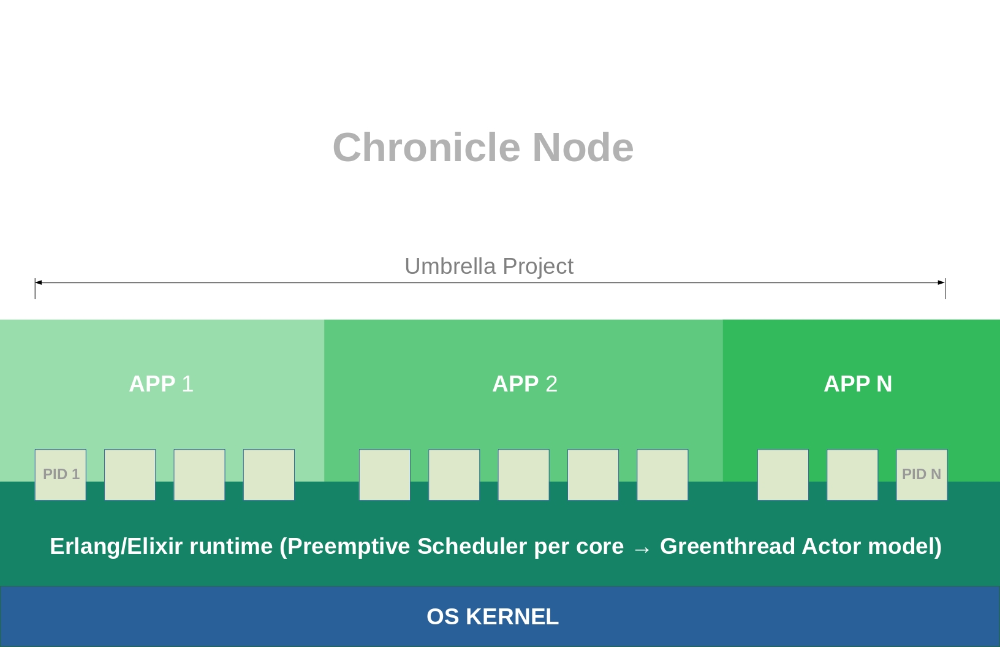
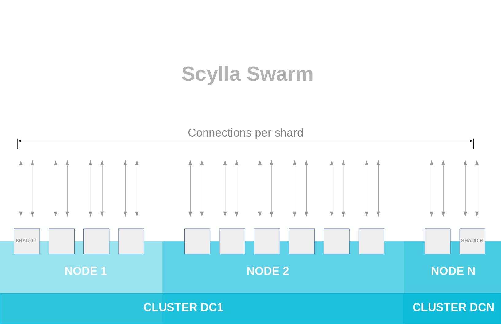

# Architecture

### [IRI nodes](https://docs.iota.org/docs/iri/0.1/introduction/overview)

Chronicle communicates with [IRI nodes](https://docs.iota.org/docs/iri/0.1/introduction/overview).

### Chronicle node

In the diagram, the Chronicle node is shown in green.  It is between IRI and the Scylla Swarm.  It contains the Umbrella Project with API services, the Core App, the ZMQ messenger, and the Explorer Service.

Currently one Chronicle node manages and supervises all the shards in the Scylla Swarm.  It does this by establishing at least one connection per shard.  All the connections are independent.  They are supervised by the Core App in the Umbrella Project.

### [Umbrella Project](umbrella_project.md)

An Umbrella project is a space where independent apps coexist and communicate through Inter-Process Communication (IPC). Each app runs under its own supervision tree.  Any app can grow and easily migrate to its own "rack".  A rack is a cluster with its own umbrella project.

### Core App

The Chronicle App may be an independent microservice or it may be dependent on other apps.  For example, a Chronicle App may depend on the shared Core App to access the Tangle.

### Scylla swarm

The Scylla swarm is shown in blue.  The Scylla swarm stores transaction data for the permanode.

