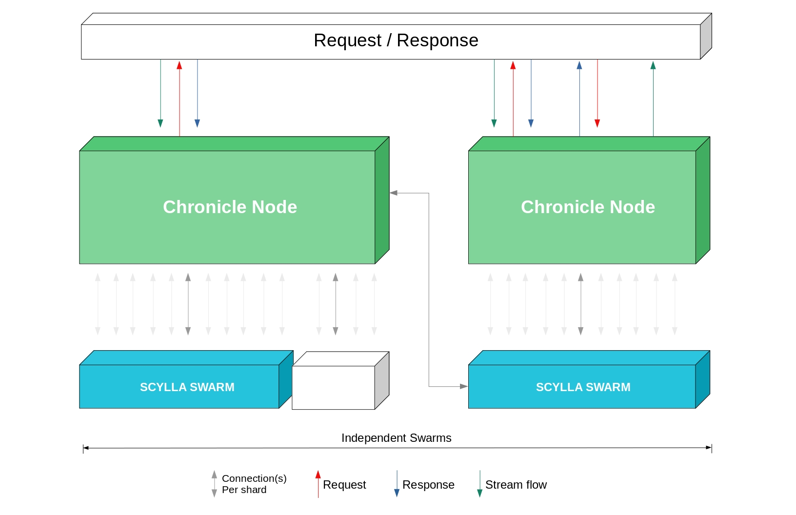

# Chronicle design

**Chronicle was developed using tools for building scalable, distributed, fault-tolerant nodes**

Chronicle has apps and a database.  The apps were built with [Elixir/Erlang](https://elixir-lang.org/) because this framework can process a very high volume of data with minimal delay.  

NOTICE:  Processing a high volume of data is called "high throughput".  Minimal delay is called "low-latency".  

Elixir provides web development tools and embedded software development tools plus a network that can be extended by building microservices.  

Chronicle was designed so that more nodes can be added as datasets grow.  In order to manage big data, Chronicle uses the [ScyllaDB](https://www.scylladb.com/) database.  ScyllaDB takes care of the big data concerns such as partitioning, replication, in-memory processing, and consistency.  It stores transaction data quickly and keeps track of "shards".  Shards are distinct groups of data.

### How Chronicle works

A data request is sent to a Chronicle node.  Chronicle gets the data from the ScyllaDB.  Scylla provides a response.  Chronicle formats and publishes the response.

### [How ScyllaDB works](https://docs.scylladb.com/using-scylla/)

ScyllaDB is a real-time, big data database featuring high throughput and low-latency.  To achieve this, ScyllaDB optimizes the physical location of the database and the logical location of the data.

#### Physical location of the database

A Scylla database may be physically located on multiple computers in multiple datacenters.  To accomplish this, build one Scylla node by installing ScyllaDB on one computer.  Next, build more nodes and create a Scylla cluster.  A Scylla cluster is one or more Scylla nodes.  These nodes do not share memory or hard-drive space.  They share their state via the Gossip protocol.  Finally, add Scylla clusters to a Scylla swarm.  Visualize a swarm as a ring of clusters.  Scylla swarms can be located in one or more datacenters.  Now, you have a distributed database.    

#### Logical location of the data

Data is stored across multiple nodes on multiple computers.  To achieve this, data is organized into rows and columns in a table.  To create a table, you define each column and the type of data it can hold.  You also define the [primary key, the partition key, and the clustering key](http://sudotutorials.com/tutorials/cassandra/cassandra-primary-key-cluster-key-partition-key.html).  Then you add rows.

The primary key is a unique identifier for each row in a table. A partition key indicates which node will hold a row of data.  Clustering keys sort data within a partition.  In a Scylla table columns are ordered by the clustering key.  Using these three keys, Scylla can locate data quickly.  

Storing and retrieving data is faster when the data is organized into distinct collections, called "shards".  Use partitions to create shards.  A Scylla partition is a logical storage unit that holds the rows identified by a partition key.  A shard is a group of data with the same partition key.  

To ensure reliability and fault tolerance, Scylla stores data replicas on multiple nodes.  These nodes are called "replica nodes".  Partitions are repeated on replica nodes.  You can set the number of replicas by setting the replication factor (RF).

Here is a diagram showing how data flows through Chronicle:

<i>Author's note:  It may be better to have 2 diagrams: a physical diagram and a logical diagram</i>
