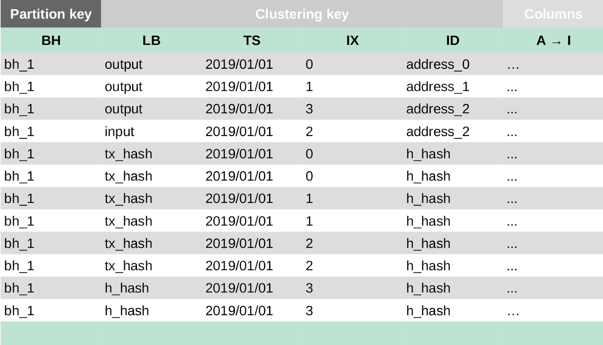
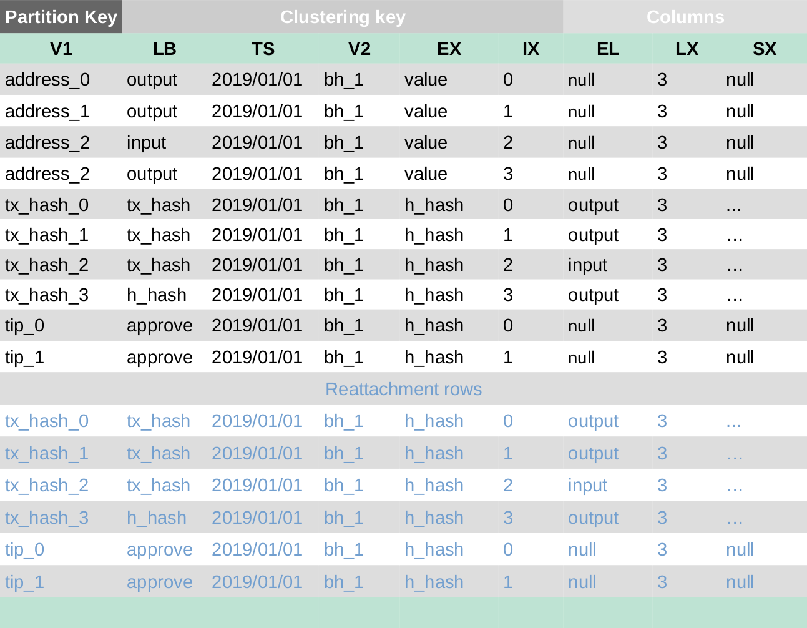

# SCYLLA data model

**This section describes the data model.**  The data model has 4 tables:  

- Bundle table - stores transaction bundles

- Edge table - 

- Tag table - limits the amount of time you can search by tag

- Zero-value table - stores spam and data transactions by month


## Bundle table

Stores transaction bundles



***Fields***

```bundle_hash``` is the main partition key.  This means all bundles with same bundle_hash are stored in the same partition and replicated to the same replicas.  

```outputs```

```inputs```

```transactions_hashes```

```head_hashes```

***How to lookup rows***

Rows are ordered by current_index(index) in ASC (ascending) order.  Lookup by finding outputs.  Use an output to locate inputs.  Use an input to find the transactions_hashes.  Then, use the head_hashes of a transactions_hash.


## Edge table

Provides secondary indexes



***Fields***

```address```

```transaction_hash```

```tip```

****How to look up rows***

The partition key can be any field

All the rows with the same partition key are stored in the same partition and replicated across the same replicas. This enables lookup by any partition key even within a time-range

***Example***

Select an address that has been used as an input or output within a time-range

## Tag table

There are two types of tag tables:

- Lookup by full tag (27 trytes)

- Lookup by full tag and IOTA Area Code
	
There can be an unlimited number of transactions that use the same tag.  This could result in too many transactions for a single node to store. One solution is to remove transactions after a given period of time.  The tag table has a predefined TTL (time-to-live) which acts as a real-time index.  When TTL is set to 1000 seconds, the row will disappear after 1000 seconds.  Searches based on tags only work for transactions younger than the TTL.

## Zero_value table

 Stores transactions with zero-value by month  

 ***Fields***
 
 Same as the edge table, except that the partition key is a composite partition key composed of address, year, month. This means only the monthly activities for that address will exist in the same shard. 
