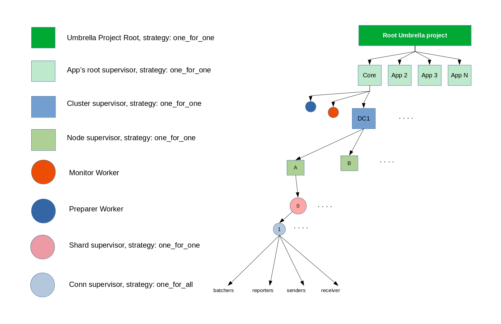

# [Umbrella Project](https://elixir-lang.org/getting-started/mix-otp/dependencies-and-umbrella-projects.html#umbrella-projects)

**The Umbrella Project includes the Core App and other apps**

Sometimes a project can get big, really big in fact. Elixir uses Umbrella Projects to split code into multiple apps and arrange them under a master or "umbrella" project.  This allows Chronicle to grow in an organized way.

### Chronicle Umbrella Project

The Chronicle Umbrella Project includes the Core App and other apps.  The Core App communicates with the Scylla swarm.  It manages database changes and dynamically reflects the changes to the swarm.  It also monitors cluster supervisors.

Other apps express business rules.  They communicate by Inter-Process Communication (IPC).  They share the Core App and use it to communicate with the Scylla swarm.

Apps take turns running.  They use a preemptive scheduling process based on a round-robin algorithm.

